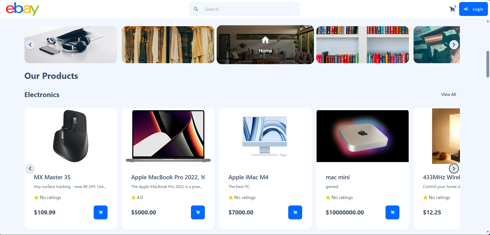
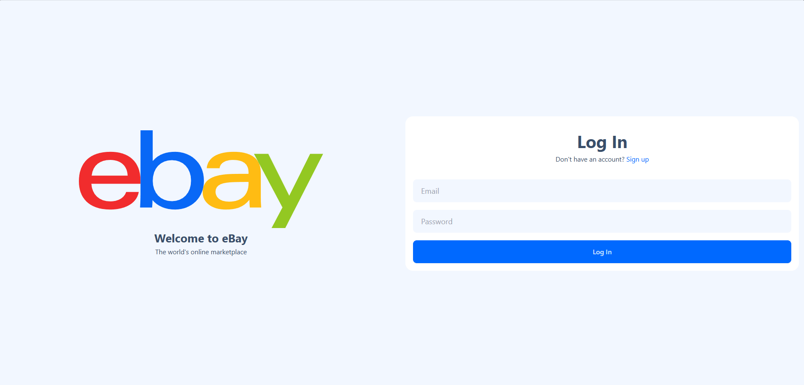
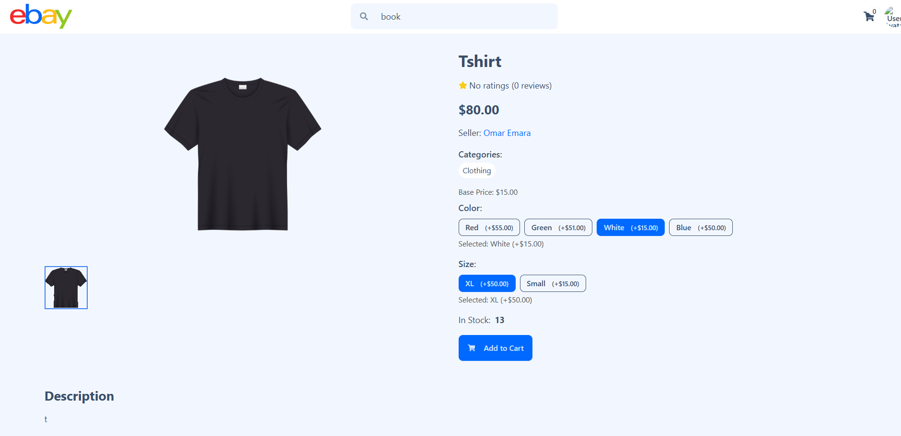
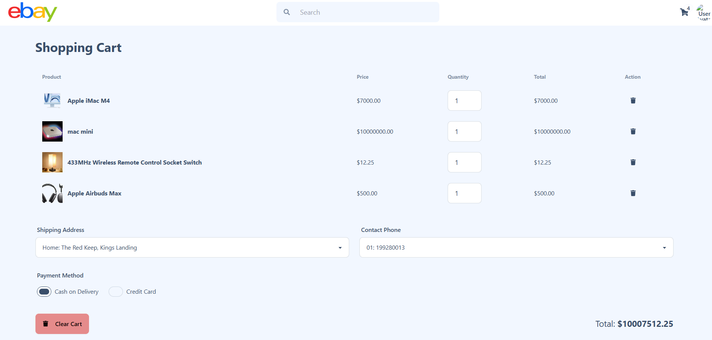
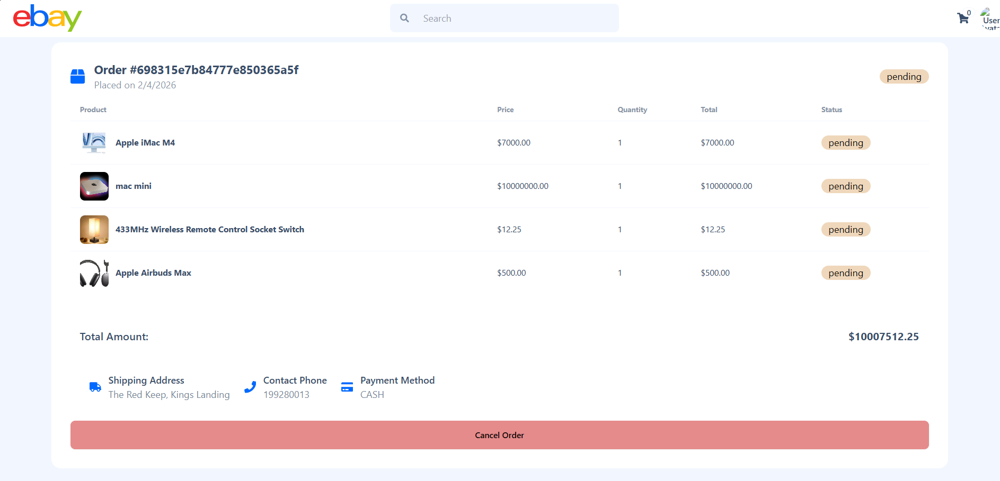
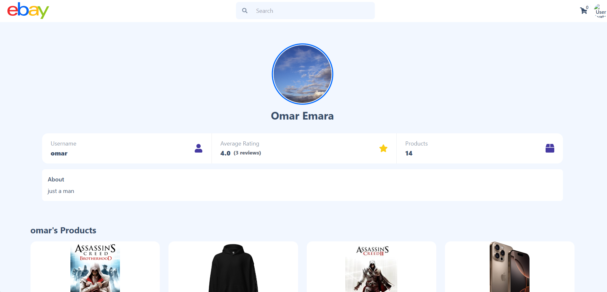
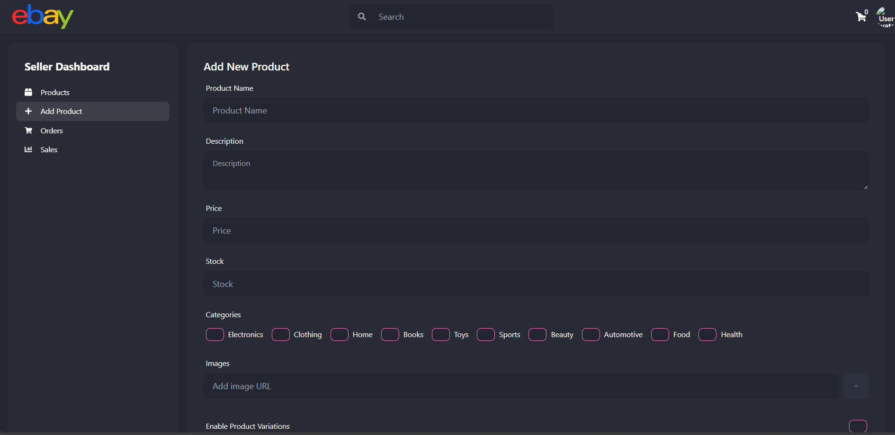
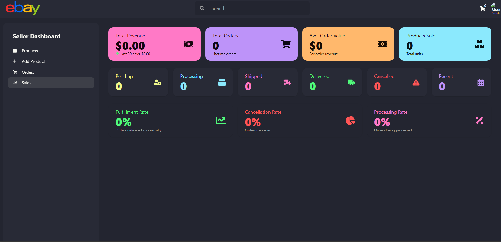

# eBay Clone - Full-Stack E-Commerce Platform

A modern, full-featured e-commerce marketplace platform built with the MERN stack (MongoDB, Express.js, React, Node.js). This application replicates core eBay functionality including product listings, shopping cart, order management, seller dashboards, and secure payment processing.



## 📋 Table of Contents

- [Features](#features)
- [Screenshots](#screenshots)
- [Tech Stack](#tech-stack)
- [Project Structure](#project-structure)
- [Installation](#installation)
- [Configuration](#configuration)
- [API Documentation](#api-documentation)
- [Testing](#testing)
- [Contributors](#contributors)

## ✨ Features

### Customer Features
- **User Authentication**: Secure login and registration with JWT tokens
- **Product Browsing**: Browse products by categories (Electronics, Clothing, Home, Books, Toys, Sports, Beauty, Automotive, Food, Health)
- **Product Search**: Search functionality to find products quickly
- **Product Details**: View detailed product information with images, pricing, and variations (color, size)
- **Shopping Cart**: Add, update, and remove items from cart
- **Order Management**: Place orders with shipping details and payment options
- **User Profiles**: View and manage user profiles with seller ratings and product listings
- **Product Reviews**: Rate and review products

### Seller Features
- **Seller Dashboard**: Comprehensive analytics dashboard showing:
  - Total revenue and sales metrics
  - Average order value
  - Products sold count
  - Order status tracking (Pending, Processing, Shipped, Delivered, Cancelled)
  - Fulfillment, cancellation, and processing rates
- **Product Management**: Add new products with:
  - Product name and description
  - Pricing and stock management
  - Category selection
  - Image uploads
  - Product variations (colors, sizes with price adjustments)
- **Order Tracking**: Monitor and manage customer orders
- **Sales Analytics**: View detailed sales performance metrics

### Payment Integration
- **PayPal Integration**: Secure payment processing via PayPal
- **Cash on Delivery**: Alternative payment method for customers

## 📸 Screenshots

### Landing Page

*Browse products by categories and search for items across the marketplace*

### User Authentication

*Secure user authentication with email and password*

### Product Details

*Detailed product view with variations (color, size), pricing, stock availability, and add to cart functionality*

### Shopping Cart

*Review cart items, adjust quantities, select shipping address and payment method before checkout*

### Order Management

*View detailed order information including products, quantities, shipping address, and order status*

### User Profile

*User profile displaying seller information, ratings, and their listed products*

### Seller Dashboard - Add Product

*Seller interface to add new products with details, categories, images, and variations*

### Seller Dashboard - Sales Analytics

*Comprehensive seller dashboard with revenue metrics, order statistics, and performance analytics*

## 🛠 Tech Stack

### Frontend
- **React 18.3.1** - UI library
- **React Router DOM 6.26.2** - Client-side routing
- **Vite 5.4.8** - Build tool and dev server
- **Tailwind CSS 3.4.13** - Utility-first CSS framework
- **DaisyUI 4.12.13** - Tailwind CSS component library
- **Axios 1.7.7** - HTTP client
- **React Icons 5.3.0** - Icon library
- **PayPal React SDK 8.7.0** - PayPal payment integration
- **UploadThing 7.3.0** - File upload handling

### Backend
- **Node.js** - JavaScript runtime
- **Express.js 4.21.0** - Web framework
- **MongoDB with Mongoose 8.7.0** - Database and ODM
- **JSON Web Tokens (jsonwebtoken 9.0.2)** - Authentication
- **bcryptjs 2.4.3** - Password hashing
- **PayPal REST SDK 1.8.1** - Payment processing
- **Express Validator 7.2.0** - Input validation
- **Joi 17.13.3** - Schema validation
- **CORS 2.8.5** - Cross-origin resource sharing
- **dotenv 16.4.5** - Environment variable management

## 📁 Project Structure

```
Ebay/
├── client/                 # Frontend React application
│   ├── public/            # Static assets
│   ├── src/
│   │   ├── assets/        # Images and SVG files
│   │   ├── components/    # Reusable React components (23 components)
│   │   ├── context/       # React Context for state management
│   │   ├── pages/         # Page components (12 pages)
│   │   ├── constants/     # Constants and configuration
│   │   ├── utils/         # Utility functions
│   │   ├── App.jsx        # Main App component
│   │   ├── Layout.jsx     # Layout wrapper
│   │   └── main.jsx       # Application entry point
│   ├── package.json
│   ├── vite.config.js
│   ├── tailwind.config.js
│   └── vercel.json        # Vercel deployment config
│
├── server/                # Backend Node.js/Express application
│   ├── config/           # Configuration files
│   │   ├── db.js         # Database connection
│   │   └── paypal.js     # PayPal configuration
│   ├── controllers/      # Route controllers
│   │   ├── authController.js
│   │   ├── orderController.js
│   │   ├── paymentController.js
│   │   ├── productController.js
│   │   └── reviewController.js
│   ├── middleware/       # Express middleware
│   │   ├── auth.js       # Authentication middleware
│   │   └── errorHandler.js
│   ├── models/          # Mongoose models
│   │   ├── User.js
│   │   ├── Product.js
│   │   ├── Order.js
│   │   ├── Payment.js
│   │   └── Review.js
│   ├── routes/          # API routes
│   │   ├── authRoutes.js
│   │   ├── orderRoutes.js
│   │   ├── paymentRoutes.js
│   │   ├── productRoutes.js
│   │   └── reviewRoutes.js
│   ├── utils/           # Utility functions
│   │   ├── inputValidators.js
│   │   └── uploadthing.js
│   ├── certificates/    # SSL certificates for HTTPS
│   ├── app.js          # Express app configuration
│   ├── server.js       # HTTP server
│   ├── server_https.js # HTTPS server
│   └── package.json
│
├── screenshots/         # Application screenshots
│   ├── landing.png
│   ├── login.png
│   ├── product.png
│   ├── cart.png
│   ├── order.png
│   ├── profile.png
│   ├── addproduct.png
│   └── sales.png
│
└── tests/              # API testing
    ├── Amir.postman_collection.json
    ├── Merihan.postman_collection.json
    ├── Omar.postman_collection.json
    ├── Sameh.postman_collection.json
    └── [Test Results]/
```

## 🚀 Installation

### Prerequisites
- Node.js (v14 or higher)
- MongoDB (local or MongoDB Atlas)
- PayPal Developer Account (for payment integration)
- UploadThing Account (for image uploads)

### Backend Setup

1. Navigate to the server directory:
```bash
cd server
```

2. Install dependencies:
```bash
npm install
```

3. Create a `.env` file in the server directory:
```env
PORT=5000
MONGO_URI=your_mongodb_connection_string
JWT_SECRET=your_jwt_secret_key
PAYPAL_CLIENT_ID=your_paypal_client_id
PAYPAL_CLIENT_SECRET=your_paypal_client_secret
UPLOADTHING_SECRET=your_uploadthing_secret
UPLOADTHING_APP_ID=your_uploadthing_app_id
NODE_ENV=development
```

4. Start the server:
```bash
# Development mode with nodemon
npm run server

# Production mode
npm start
```

The server will run on `http://localhost:5000`

### Frontend Setup

1. Navigate to the client directory:
```bash
cd client
```

2. Install dependencies:
```bash
npm install
```

3. Create a `.env` file in the client directory:
```env
VITE_API_URL=http://localhost:5000
VITE_PAYPAL_CLIENT_ID=your_paypal_client_id
VITE_UPLOADTHING_APP_ID=your_uploadthing_app_id
```

4. Start the development server:
```bash
npm run dev
```

The application will run on `http://localhost:5173`

## ⚙️ Configuration

### MongoDB Setup
1. Create a MongoDB database (local or Atlas)
2. Copy your connection string to the `MONGO_URI` environment variable
3. The application will automatically create the necessary collections

### PayPal Setup
1. Create a PayPal Developer account at [developer.paypal.com](https://developer.paypal.com)
2. Create a REST API app
3. Copy the Client ID and Secret to your `.env` files
4. Configure sandbox accounts for testing

### UploadThing Setup
1. Create an account at [uploadthing.com](https://uploadthing.com)
2. Create a new app
3. Copy the App ID and Secret to your `.env` files

### HTTPS Configuration (Optional)
For HTTPS support, place your SSL certificates in the `server/certificates/` directory and use `server_https.js` instead of `server.js`.

## 📡 API Documentation

### Authentication Endpoints
- `POST /api/auth/register` - Register new user
- `POST /api/auth/login` - Login user
- `GET /api/auth/user` - Get current user (protected)

### Product Endpoints
- `GET /api/products` - Get all products
- `GET /api/products/:id` - Get product by ID
- `POST /api/products` - Create new product (protected, seller only)
- `PUT /api/products/:id` - Update product (protected, seller only)
- `DELETE /api/products/:id` - Delete product (protected, seller only)
- `GET /api/products/category/:category` - Get products by category
- `GET /api/products/search?q=keyword` - Search products

### Order Endpoints
- `GET /api/orders` - Get user orders (protected)
- `GET /api/orders/:id` - Get order by ID (protected)
- `POST /api/orders` - Create new order (protected)
- `PUT /api/orders/:id/status` - Update order status (protected, seller only)
- `DELETE /api/orders/:id` - Cancel order (protected)

### Payment Endpoints
- `POST /api/payments/paypal/create` - Create PayPal payment
- `POST /api/payments/paypal/execute` - Execute PayPal payment
- `POST /api/payments/cod` - Process cash on delivery

### Review Endpoints
- `GET /api/reviews/product/:productId` - Get product reviews
- `POST /api/reviews` - Create review (protected)
- `PUT /api/reviews/:id` - Update review (protected)
- `DELETE /api/reviews/:id` - Delete review (protected)

## 🧪 Testing

The project includes Postman collections for API testing:

### Available Test Collections
- **Amir.postman_collection.json** - Authentication and user tests
- **Merihan.postman_collection.json** - Product management tests
- **Omar.postman_collection.json** - Order processing tests
- **Sameh.postman_collection.json** - Payment integration tests

### Running Tests
1. Import the Postman collection files into Postman
2. Configure environment variables in Postman
3. Run the collections to test API endpoints
4. Test results are available in the `tests/[Name] Test Results/` directories

## 🤝 Contributors

This project was developed as part of a Cloud Computing course:

- **Amir** - Authentication & User Management
- **Merihan** - Product Management & Catalog
- **Omar** - Order Processing & Management
- **Sameh** - Payment Integration

## 📝 License

This project is created for educational purposes as part of a Cloud Computing course.

## 🔒 Security Features

- JWT-based authentication
- Password hashing with bcrypt
- Input validation and sanitization
- CORS protection
- Express security middleware
- Secure payment processing via PayPal

## 🎨 UI/UX Features

- Responsive design for mobile and desktop
- Modern, clean interface with Tailwind CSS and DaisyUI
- Interactive product variations
- Real-time cart updates
- Intuitive seller dashboard
- Category-based navigation
- Search functionality

## 🚧 Future Enhancements

- Email notifications for orders
- Advanced search filters
- Wishlist functionality
- Live chat support
- Multi-language support
- Admin dashboard
- Seller verification system
- Product recommendations
- Social media integration

---

**Note**: This is an educational project and should not be used in production without proper security audits and additional features for a real marketplace.
